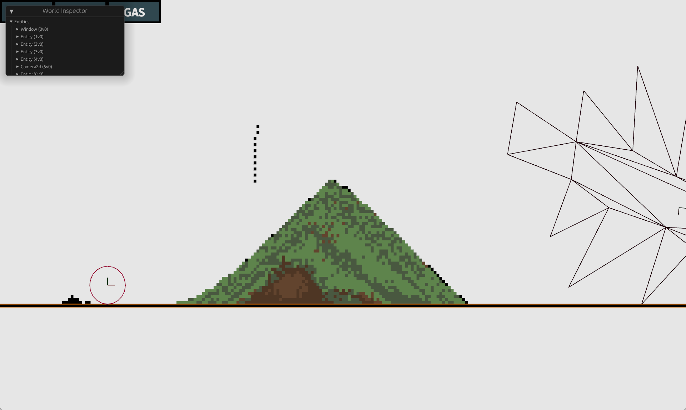

# celling
Try to imitate noita's physic system using bevy.

# usage
```
git submodule update --init
cd crates/celling
cargo run --example celling_test1

WASD move the camera
```

# note
This is not ganna work cause you have to create at least 1000 * 1000 entity for simulation, and Bevy's entity still too heavy for doing this.I've not figure it out how to solve it.

# screen shot


